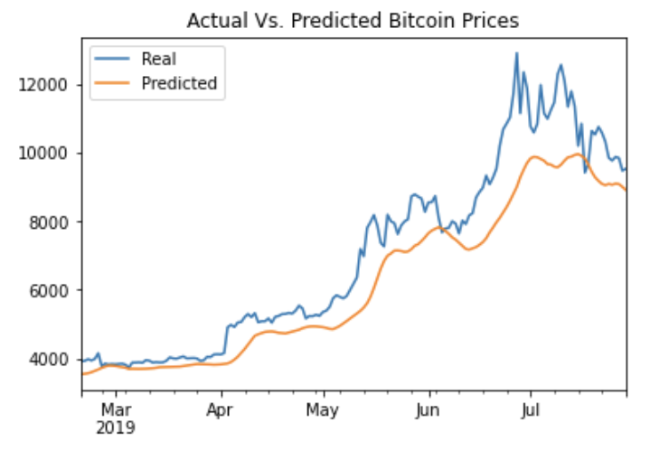
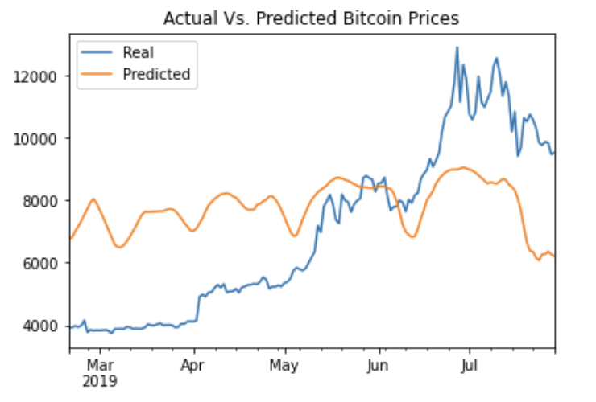

# LSTM-Stock-Predictor-DL

Due to the volatility of cryptocurrency speculation, investors will often try to incorporate sentiment from social media and news articles to help guide their trading strategies. One such indicator is the [Crypto Fear and Greed Index (FNG)](https://alternative.me/crypto/fear-and-greed-index/) which attempts to use a variety of data sources to produce a daily FNG value for cryptocurrency. You have been asked to help build and evaluate deep learning models using both the FNG values and simple closing prices to determine if the FNG indicator provides a better signal for cryptocurrencies than the normal closing price data.

In this assignment, you will use deep learning recurrent neural networks to model bitcoin closing prices. The first model will use a window of closing prices to predict the future closing prices and the second model will use FNG as the indicator to predict future closing prices.

## Homework Objectives:

1. Prepare the data for training and testing

2. Build and train custom LSTM RNNs (with one model using a window of closing prices to predict future BTC closing prices and the second model using the FNG index as the indicator to predict future BTC closing prices).

3. Evaluate the performance of each model

## Homework Outcomes:

**LSTM RNN Model #1 - Closing Price Indicator**
---

**LSTM RNN Model #2 - FNG Index Indicator**
---

**Question Responses**:

**Question 1:** Which model has a lower loss?

**Question 1 Response:** LSTM RNN Model #1 (i.e., the closing price indicator model) has the lowest loss at less than 1%.

**Question 2:** Which model tracks the actual values better over time?

**Question 2 Response:** LSTM RNN Model #1 (i.e., the closing price indicator model) tracks the actual BTC values better over time.  This is clearly shown on the summary prediction charts above when comparing the Model #1 chart (with price indicator) vs. the Model #2 chart (with FNG indicator).

**Question 3:** Which window size works best for the model?

**Question 3 Response:** After testing the window size, it appears that a window between 5 and 10 days works the best for predictions for both models.  8 days is the optimal window that results in the lowest model loss.
